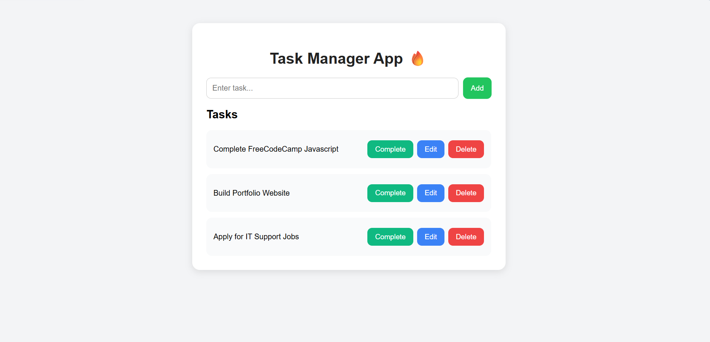
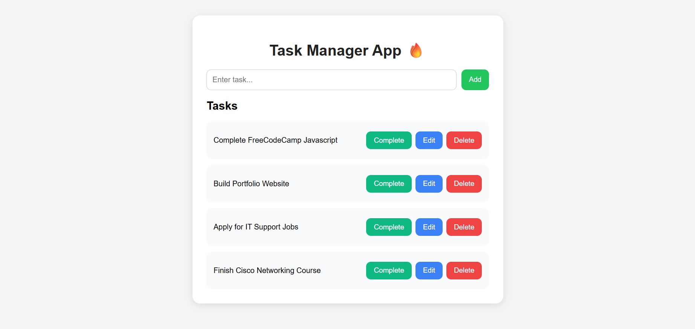
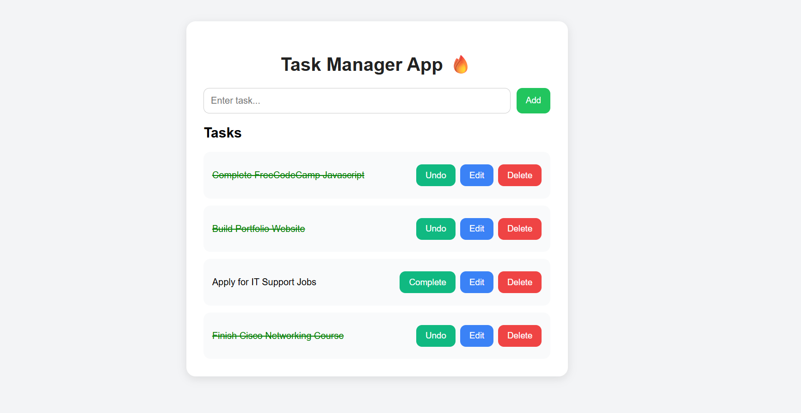

# 🚀 Full Stack Task Manager

A full-stack task management application built with React, Node.js, Express, and SQLite.

Helps users manage tasks, track progress, and stay organized.

## ✨ Features

- Add tasks
- View task list
- Mark tasks completed
- Delete tasks
- Full-stack integration
- SQLite database support

## 🛠 Tech Stack

### Frontend
- React.js
- CSS

### Backend
- Node.js
- Express.js
- SQLite

## 📸 App Screenshots

### 🏠 Dashboard

### ➕ Add Task

### ✅ Task List

## 📚 What I Learned

This project helped me practice:

- Full-stack development
- React fundamentals
- REST APIs
- SQLite database integration
- Git & GitHub workflow

## 👨‍💻 Author

James Snethemba Ntshingila                                                                                                                                                                                                
Email: jj6507544@gmail.com                                                                                                                                                                                         Contacts: 0683513638                                                                                                                                                                                               GitHub: https://github.com/Jj879304
